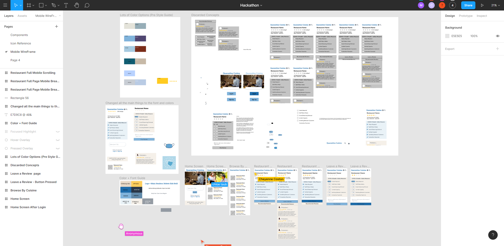
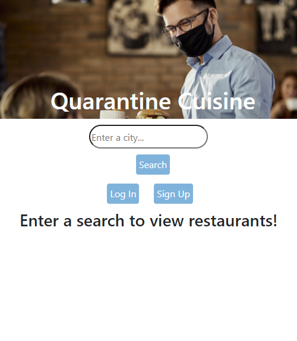
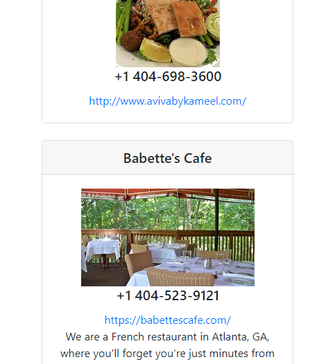

# Quarantine-Cuisine

The Best Team: Cheyenne Coston, Chloe Taub, Stavon Boavida, Tori Moline, and Earl Lampley

### A way to dine in safety

---
[Open Quantine-Cuisine](LINK)

## Contents
* Objective
* Minimum Viable Product
* ERD/Wireframes
* Screenshots
* Stretch Goals
* Technologies Implemented

### Objective
For everyone who needs to dine in safety allow users to review, and browse reviews of how restraunts are handling pandemic dining. 

---

## Minimum Viable Product
* AAU I should be able to register for an account.
* AAU I should be able to login/out
* AAU I should be able to search nearby restautrants 
* AAU I should be able to view reviews of other users
* AAU I should bne able to leave a review

---

## ERD and Wireframes

#### ERD

---

#### WireFrame

---

## Screenshots

---

---

---

## Stretch Goals/ What Comes Next

- [ ] Implement other places/locations to review
- [ ] Give Restraunts the ability to answer reviews and update their own page

---

## Technologies Used
- Javascript - programming language for websites
- Html - programming language for websites
- CSS - programming language for websites
- NodeJS - Node.js is an open-source, cross-platform, back end, JavaScript runtime environment that executes JavaScript code outside a web browser
- ExpressJS - back end web application framework for Node.js
- Express Generator - automatically build an express template
- MongoDB - database of reviews and users
- React - JavaScript library for building user interfaces or UI components
- AWS-SDK - image uploader
- Multer3 - image uploader
- Postman API Development - testing for api calls
- JWT OAuth - authentication for users
- Git - hosting
- Figma - Building outlines 
